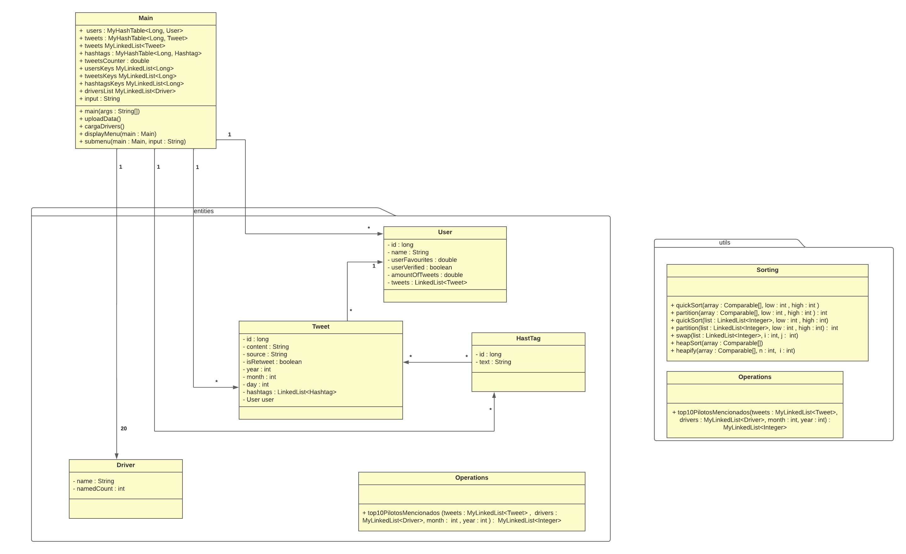

# Obligatorio 2023, Magalí Dellapiazza
# Diagrama UML:
Diagrama semi completo (a partir de lo que logré hacer):

Dentro de mis capacidades hice todo lo que estaba a mi alcance pero me tranqué en varias cosas que no me permitieron continuar, siendo que era solamente yo la que estaba trabajando en el proyecto.

Me encontré bastante trancada al momento de pensar en las estructuras en donde guardar los datos, también con las importaciones del apache y del csv.

Me surgieron dudas de por ejemplo si el id del hashtag era único para cada uno (porque no le veía sentido a que sea el id del tweet). Hice la estructura básica del menú pero no pude continuar.